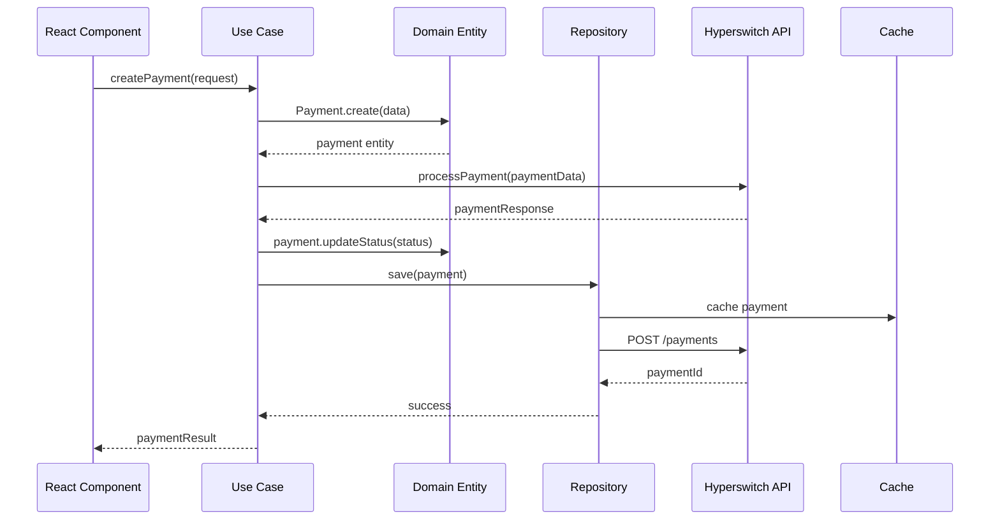
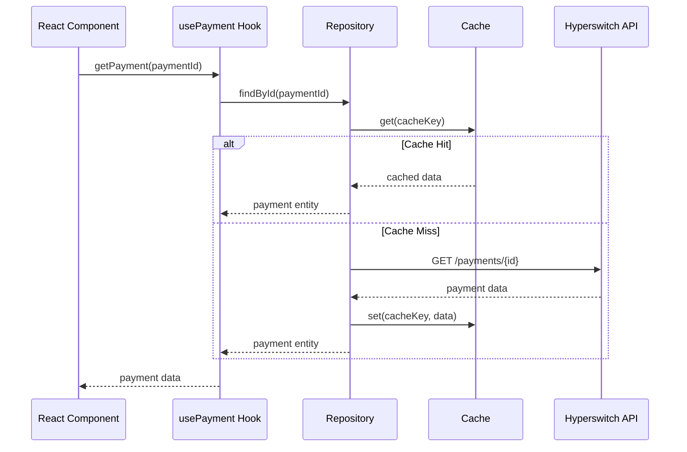

# Arquitectura del Sistema - Multipaga

## Tabla de Contenidos

- [Descripción General](#descripción-general)
- [Arquitectura Hexagonal](#arquitectura-hexagonal)
- [Capas del Sistema](#capas-del-sistema)
- [Patrones de Diseño](#patrones-de-diseño)
- [Stack Tecnológico](#stack-tecnológico)
- [Estructura de Directorios](#estructura-de-directorios)
- [Flujo de Datos](#flujo-de-datos)
- [Componentes Principales](#componentes-principales)
- [Integración de APIs](#integración-de-apis)
- [Seguridad](#seguridad)
- [Escalabilidad](#escalabilidad)
- [Testing](#testing)
- [Monitoreo y Observabilidad](#monitoreo-y-observabilidad)

## Descripción General

Multipaga es una plataforma de gestión de pagos construida sobre **Arquitectura Hexagonal** (Ports & Adapters), diseñada para proporcionar una interfaz unificada para múltiples procesadores de pago a través de **Hyperswitch**.

### Principios Arquitectónicos

1. **Separación de Responsabilidades**: Cada capa tiene una responsabilidad específica y bien definida
2. **Inversión de Dependencias**: Las dependencias apuntan hacia el centro (dominio)
3. **Testabilidad**: Arquitectura que facilita testing unitario e integración
4. **Extensibilidad**: Fácil agregar nuevos conectores o funcionalidades
5. **Mantenibilidad**: Código organizado y fácil de entender

## Arquitectura Hexagonal

```
┌─────────────────────────────────────────────────────────────────┐
│                        INFRASTRUCTURE                          │
│  ┌─────────────┐  ┌─────────────┐  ┌─────────────────────────┐  │
│  │  HTTP API   │  │  Database   │  │    External APIs        │  │
│  │ (Next.js)   │  │  (Cache)    │  │    (Hyperswitch)        │  │
│  └─────────────┘  └─────────────┘  └─────────────────────────┘  │
│         │                 │                        │            │
└─────────┼─────────────────┼────────────────────────┼────────────┘
          │                 │                        │
┌─────────┼─────────────────┼────────────────────────┼────────────┐
│         │                 │                        │            │
│  ┌─────────────┐  ┌─────────────┐  ┌─────────────────────────┐  │
│  │ Controllers │  │ Repositories│  │    HTTP Clients         │  │
│  └─────────────┘  └─────────────┘  └─────────────────────────┘  │
│         │                 │                        │            │
│                        APPLICATION                              │
│  ┌─────────────────────────────────────────────────────────┐   │
│  │                   Use Cases                             │   │
│  │  ┌─────────────┐  ┌─────────────┐  ┌─────────────────┐ │   │
│  │  │  Payments   │  │   Refunds   │  │ Reconciliation  │ │   │
│  │  └─────────────┘  └─────────────┘  └─────────────────┘ │   │
│  └─────────────────────────────────────────────────────────┘   │
│         │                 │                        │            │
└─────────┼─────────────────┼────────────────────────┼────────────┘
          │                 │                        │
┌─────────┼─────────────────┼────────────────────────┼────────────┐
│         │                 │                        │            │
│                          DOMAIN                                 │
│  ┌─────────────────────────────────────────────────────────┐   │
│  │                   Entities                              │   │
│  │  ┌─────────────┐  ┌─────────────┐  ┌─────────────────┐ │   │
│  │  │ Transaction │  │   Refund    │  │    Customer     │ │   │
│  │  └─────────────┘  └─────────────┘  └─────────────────┘ │   │
│  └─────────────────────────────────────────────────────────┘   │
│  ┌─────────────────────────────────────────────────────────┐   │
│  │                Value Objects                            │   │
│  │  ┌─────────────┐  ┌─────────────┐  ┌─────────────────┐ │   │
│  │  │    Money    │  │ PaymentStatus│  │   DateRange     │ │   │
│  │  └─────────────┘  └─────────────┘  └─────────────────┘ │   │
│  └─────────────────────────────────────────────────────────┘   │
│  ┌─────────────────────────────────────────────────────────┐   │
│  │                Repository Interfaces                   │   │
│  └─────────────────────────────────────────────────────────┘   │
└─────────────────────────────────────────────────────────────────┘
          │                 │                        │
┌─────────┼─────────────────┼────────────────────────┼────────────┐
│         │                 │                        │            │
│                       PRESENTATION                              │
│  ┌─────────────────────────────────────────────────────────┐   │
│  │                React Components                         │   │
│  │  ┌─────────────┐  ┌─────────────┐  ┌─────────────────┐ │   │
│  │  │    Pages    │  │ Components  │  │     Hooks       │ │   │
│  │  └─────────────┘  └─────────────┘  └─────────────────┘ │   │
│  └─────────────────────────────────────────────────────────┘   │
│  ┌─────────────────────────────────────────────────────────┐   │
│  │                   Contexts                              │   │
│  │  ┌─────────────┐  ┌─────────────┐  ┌─────────────────┐ │   │
│  │  │  Merchant   │  │    Theme    │  │   Notification  │ │   │
│  │  └─────────────┘  └─────────────┘  └─────────────────┘ │   │
│  └─────────────────────────────────────────────────────────┘   │
└─────────────────────────────────────────────────────────────────┘
```

## Capas del Sistema

### 1. Domain Layer (Núcleo del Negocio)

La capa de dominio contiene la lógica de negocio pura, libre de dependencias externas.

```typescript
// src/domain/entities/Transaction.ts
export class Transaction {
  constructor(
    public readonly id: TransactionId,
    public readonly amount: Money,
    public readonly status: PaymentStatus,
    public readonly customerId: CustomerId,
    public readonly createdAt: Date
  ) {}

  public capture(amount?: Money): void {
    if (this.status !== PaymentStatus.AUTHORIZED) {
      throw new InvalidTransactionStateError('Cannot capture non-authorized transaction')
    }
    // Business logic here
  }

  public refund(amount: Money, reason: RefundReason): Refund {
    if (this.status !== PaymentStatus.CAPTURED) {
      throw new InvalidTransactionStateError('Cannot refund non-captured transaction')
    }
    // Business logic here
  }
}
```

```typescript
// src/domain/value-objects/Money.ts
export class Money {
  constructor(
    public readonly amount: number,
    public readonly currency: Currency
  ) {
    if (amount < 0) {
      throw new InvalidAmountError('Amount cannot be negative')
    }
  }

  public add(other: Money): Money {
    if (!this.currency.equals(other.currency)) {
      throw new CurrencyMismatchError('Cannot add different currencies')
    }
    return new Money(this.amount + other.amount, this.currency)
  }

  public equals(other: Money): boolean {
    return this.amount === other.amount && this.currency.equals(other.currency)
  }
}
```

### 2. Application Layer (Casos de Uso)

Contiene la lógica de aplicación y orquesta las operaciones del dominio.

```typescript
// src/application/use-cases/payments/CreatePayment.ts
export class CreatePaymentUseCase {
  constructor(
    private paymentRepository: IPaymentRepository,
    private customerRepository: ICustomerRepository,
    private paymentGateway: IPaymentGateway,
    private eventBus: IEventBus
  ) {}

  async execute(request: CreatePaymentRequest): Promise<CreatePaymentResponse> {
    // 1. Validate input
    const validatedRequest = CreatePaymentRequestSchema.parse(request)

    // 2. Get customer
    const customer = await this.customerRepository.findById(validatedRequest.customerId)
    if (!customer) {
      throw new CustomerNotFoundError()
    }

    // 3. Create domain entity
    const payment = Payment.create({
      amount: new Money(validatedRequest.amount, validatedRequest.currency),
      customerId: customer.id,
      paymentMethod: validatedRequest.paymentMethod,
    })

    // 4. Process through gateway
    const gatewayResponse = await this.paymentGateway.processPayment({
      paymentId: payment.id.value,
      amount: payment.amount.amount,
      currency: payment.amount.currency.code,
      paymentMethodData: validatedRequest.paymentMethodData,
    })

    // 5. Update payment status
    payment.updateStatus(gatewayResponse.status)

    // 6. Persist
    await this.paymentRepository.save(payment)

    // 7. Publish event
    await this.eventBus.publish(new PaymentCreatedEvent(payment))

    return {
      paymentId: payment.id.value,
      status: payment.status.value,
      amount: payment.amount.amount,
      currency: payment.amount.currency.code,
    }
  }
}
```

### 3. Infrastructure Layer (Adaptadores)

Implementa las interfaces definidas en el dominio para interactuar con sistemas externos.

```typescript
// src/infrastructure/repositories/HttpPaymentRepository.ts
export class HttpPaymentRepository implements IPaymentRepository {
  constructor(
    private httpClient: IHttpClient,
    private cache: ICache,
    private logger: ILogger
  ) {}

  async save(payment: Payment): Promise<void> {
    try {
      const paymentData = PaymentMapper.toHyperswitch(payment)
      
      await this.httpClient.post('/payments', paymentData)
      
      // Cache for quick retrieval
      await this.cache.set(
        CacheKeys.payment(payment.id.value),
        paymentData,
        CacheKeys.TTL.PAYMENT
      )
      
      this.logger.info('Payment saved', { paymentId: payment.id.value })
    } catch (error) {
      this.logger.error('Failed to save payment', { 
        paymentId: payment.id.value, 
        error 
      })
      throw new PaymentPersistenceError('Failed to save payment', error)
    }
  }

  async findById(id: PaymentId): Promise<Payment | null> {
    try {
      // Try cache first
      const cacheKey = CacheKeys.payment(id.value)
      const cachedData = await this.cache.get(cacheKey)
      
      if (cachedData) {
        return PaymentMapper.toDomain(cachedData)
      }

      // Fetch from API
      const response = await this.httpClient.get(`/payments/${id.value}`)
      const payment = PaymentMapper.toDomain(response.data)
      
      // Cache result
      await this.cache.set(cacheKey, response.data, CacheKeys.TTL.PAYMENT)
      
      return payment
    } catch (error) {
      if (error.response?.status === 404) {
        return null
      }
      throw new PaymentRetrievalError('Failed to retrieve payment', error)
    }
  }
}
```

### 4. Presentation Layer (UI)

Contiene los componentes de React y la lógica de presentación.

```typescript
// src/presentation/components/payments/PaymentDetails.tsx
export function PaymentDetails({ paymentId }: { paymentId: string }) {
  const { data: payment, isLoading, error } = usePayment(paymentId)
  const { user } = useAuth()
  const { checkPermission } = useMerchant()

  const canRefund = checkPermission('canCreateRefunds') && 
                   payment?.status === 'captured'

  if (isLoading) return <PaymentDetailsSkeleton />
  if (error) return <ErrorDisplay error={error} />
  if (!payment) return <NotFoundDisplay />

  return (
    <div className="space-y-6">
      <PaymentStatusCard payment={payment} />
      <PaymentTransactionDetails payment={payment} />
      <PaymentCustomerInfo customer={payment.customer} />
      
      {canRefund && (
        <PaymentActions 
          payment={payment}
          onRefund={() => openRefundModal(payment)}
        />
      )}
    </div>
  )
}
```

## Patrones de Diseño

### 1. Repository Pattern

```typescript
// Domain Interface
export interface IPaymentRepository {
  save(payment: Payment): Promise<void>
  findById(id: PaymentId): Promise<Payment | null>
  findByCustomerId(customerId: CustomerId): Promise<Payment[]>
  list(filters: PaymentFilters): Promise<PaginatedResult<Payment>>
}

// Infrastructure Implementation
export class HttpPaymentRepository implements IPaymentRepository {
  // Implementation details...
}
```

### 2. Factory Pattern

```typescript
// src/infrastructure/factories/PaymentGatewayFactory.ts
export class PaymentGatewayFactory {
  static create(connector: ConnectorType): IPaymentGateway {
    switch (connector) {
      case 'hyperswitch':
        return new HyperswitchGateway()
      case 'stripe':
        return new StripeGateway()
      case 'paypal':
        return new PayPalGateway()
      default:
        throw new UnsupportedConnectorError(`Connector ${connector} not supported`)
    }
  }
}
```

### 3. Strategy Pattern

```typescript
// src/domain/services/PaymentProcessingStrategy.ts
export interface PaymentProcessingStrategy {
  process(payment: Payment): Promise<PaymentResult>
  canHandle(paymentMethod: PaymentMethod): boolean
}

export class CardPaymentStrategy implements PaymentProcessingStrategy {
  canHandle(paymentMethod: PaymentMethod): boolean {
    return paymentMethod.type === 'card'
  }

  async process(payment: Payment): Promise<PaymentResult> {
    // Card-specific processing logic
  }
}

export class BankTransferStrategy implements PaymentProcessingStrategy {
  canHandle(paymentMethod: PaymentMethod): boolean {
    return paymentMethod.type === 'bank_transfer'
  }

  async process(payment: Payment): Promise<PaymentResult> {
    // Bank transfer processing logic
  }
}
```

### 4. Observer Pattern (Event-Driven)

```typescript
// src/domain/events/DomainEvent.ts
export abstract class DomainEvent {
  public readonly occurredOn: Date = new Date()
  public readonly eventId: string = generateUUID()
  
  abstract getEventName(): string
}

// src/domain/events/PaymentCreatedEvent.ts
export class PaymentCreatedEvent extends DomainEvent {
  constructor(public readonly payment: Payment) {
    super()
  }

  getEventName(): string {
    return 'payment.created'
  }
}

// Event Handler
export class PaymentCreatedEventHandler {
  constructor(
    private notificationService: INotificationService,
    private analyticsService: IAnalyticsService
  ) {}

  async handle(event: PaymentCreatedEvent): Promise<void> {
    // Send notification
    await this.notificationService.sendPaymentConfirmation(
      event.payment.customerId,
      event.payment
    )

    // Track analytics
    await this.analyticsService.trackPaymentCreated({
      paymentId: event.payment.id.value,
      amount: event.payment.amount.amount,
      currency: event.payment.amount.currency.code,
    })
  }
}
```

### 5. Command Pattern

```typescript
// src/application/commands/Command.ts
export interface Command {
  execute(): Promise<void>
  undo?(): Promise<void>
}

// src/application/commands/ProcessPaymentCommand.ts
export class ProcessPaymentCommand implements Command {
  constructor(
    private payment: Payment,
    private paymentGateway: IPaymentGateway,
    private paymentRepository: IPaymentRepository
  ) {}

  async execute(): Promise<void> {
    const result = await this.paymentGateway.process(this.payment)
    this.payment.updateStatus(result.status)
    await this.paymentRepository.save(this.payment)
  }

  async undo(): Promise<void> {
    // Implement compensation logic if needed
    await this.paymentGateway.cancel(this.payment.id)
  }
}
```

## Stack Tecnológico

### Frontend
- **Framework**: Next.js 14 (App Router)
- **Language**: TypeScript 5.x
- **Styling**: Tailwind CSS
- **UI Components**: Radix UI + Custom Components
- **State Management**: React Context + Custom Hooks
- **Data Fetching**: SWR / React Query
- **Forms**: React Hook Form + Zod
- **Icons**: Lucide React
- **Date Handling**: date-fns
- **Charts**: Recharts
- **Animations**: Framer Motion

### Backend/API
- **Runtime**: Node.js 18+
- **API**: Next.js API Routes
- **Validation**: Zod
- **HTTP Client**: Axios
- **Caching**: Redis (production) / In-memory (development)
- **Logging**: Winston
- **Error Tracking**: Sentry

### Development Tools
- **Package Manager**: npm/yarn
- **Code Quality**: ESLint + Prettier
- **Testing**: Jest + React Testing Library
- **Type Checking**: TypeScript
- **Git Hooks**: Husky + lint-staged
- **Documentation**: TypeDoc

### Infrastructure
- **Hosting**: Vercel (production)
- **Database**: No persistent database (stateless)
- **Cache**: Redis Cloud
- **Monitoring**: Vercel Analytics + Sentry
- **CDN**: Vercel Edge Network

### External Services
- **Payment Processing**: Hyperswitch
- **Authentication**: Custom JWT
- **Error Monitoring**: Sentry
- **Analytics**: Vercel Analytics

## Estructura de Directorios

```
multipaga/
├── app/                          # Next.js App Router
│   ├── (auth)/                   # Rutas de autenticación
│   │   ├── login/
│   │   └── register/
│   ├── (dashboard)/              # Rutas del dashboard
│   │   ├── payments/
│   │   ├── refunds/
│   │   ├── reconciliation/
│   │   └── settings/
│   ├── api/                      # API Routes
│   │   ├── auth/
│   │   ├── hyperswitch/
│   │   └── webhooks/
│   ├── globals.css
│   ├── layout.tsx
│   └── page.tsx
├── src/                          # Código fuente principal
│   ├── domain/                   # Capa de dominio
│   │   ├── entities/             # Entidades de negocio
│   │   │   ├── Transaction.ts
│   │   │   ├── Refund.ts
│   │   │   └── Customer.ts
│   │   ├── value-objects/        # Objetos de valor
│   │   │   ├── Money.ts
│   │   │   ├── PaymentStatus.ts
│   │   │   └── DateRange.ts
│   │   ├── repositories/         # Interfaces de repositorios
│   │   │   ├── IPaymentRepository.ts
│   │   │   └── ICustomerRepository.ts
│   │   ├── services/             # Servicios de dominio
│   │   │   └── PaymentDomainService.ts
│   │   └── events/               # Eventos de dominio
│   │       ├── PaymentCreatedEvent.ts
│   │       └── RefundProcessedEvent.ts
│   ├── application/              # Capa de aplicación
│   │   ├── use-cases/            # Casos de uso
│   │   │   ├── payments/
│   │   │   ├── refunds/
│   │   │   └── reconciliation/
│   │   ├── ports/                # Interfaces para servicios
│   │   │   ├── IHttpClient.ts
│   │   │   ├── ICache.ts
│   │   │   └── ILogger.ts
│   │   └── dtos/                 # Data Transfer Objects
│   │       ├── PaymentDTO.ts
│   │       └── RefundDTO.ts
│   ├── infrastructure/           # Capa de infraestructura
│   │   ├── api/                  # Clientes HTTP
│   │   │   ├── HttpClient.ts
│   │   │   └── HyperswitchClient.ts
│   │   ├── repositories/         # Implementaciones de repositorios
│   │   │   ├── HttpPaymentRepository.ts
│   │   │   └── HttpCustomerRepository.ts
│   │   ├── cache/                # Implementaciones de cache
│   │   │   ├── RedisCache.ts
│   │   │   └── InMemoryCache.ts
│   │   ├── logging/              # Sistema de logging
│   │   │   └── WinstonLogger.ts
│   │   └── security/             # Seguridad
│   │       ├── JwtService.ts
│   │       └── EncryptionService.ts
│   └── presentation/             # Capa de presentación
│       ├── components/           # Componentes React
│       │   ├── ui/               # Componentes base
│       │   ├── payments/         # Componentes de pagos
│       │   ├── refunds/          # Componentes de reembolsos
│       │   └── reconciliation/   # Componentes de reconciliación
│       ├── hooks/                # Custom hooks
│       │   ├── usePayments.ts
│       │   └── useAuth.ts
│       ├── contexts/             # React contexts
│       │   ├── MerchantContext.tsx
│       │   └── ThemeContext.tsx
│       └── lib/                  # Utilidades
│           ├── utils.ts
│           └── constants.ts
├── types/                        # Definiciones de tipos globales
│   ├── hyperswitch.ts
│   └── common.ts
├── docs/                         # Documentación
│   ├── architecture.md
│   ├── api-integration.md
│   ├── deployment.md
│   └── troubleshooting.md
├── tests/                        # Tests
│   ├── unit/
│   ├── integration/
│   └── e2e/
├── public/                       # Archivos estáticos
├── .env.example                  # Variables de entorno ejemplo
├── .gitignore
├── next.config.js
├── package.json
├── README.md
├── tailwind.config.js
└── tsconfig.json
```

## Flujo de Datos

### 1. Flujo de Creación de Pago



### 2. Flujo de Consulta de Pago



## Componentes Principales

### 1. Payment Manager

```typescript
// src/application/services/PaymentManager.ts
export class PaymentManager {
  constructor(
    private paymentRepository: IPaymentRepository,
    private paymentGateway: IPaymentGateway,
    private eventBus: IEventBus
  ) {}

  async createPayment(request: CreatePaymentRequest): Promise<Payment> {
    // Validation, processing, persistence, and events
  }

  async capturePayment(paymentId: PaymentId, amount?: Money): Promise<void> {
    // Capture logic
  }

  async refundPayment(paymentId: PaymentId, request: RefundRequest): Promise<Refund> {
    // Refund logic
  }
}
```

### 2. Reconciliation Engine

```typescript
// src/application/services/ReconciliationEngine.ts
export class ReconciliationEngine {
  constructor(
    private paymentRepository: IPaymentRepository,
    private reconciliationRepository: IReconciliationRepository,
    private connectorClients: Map<string, IConnectorClient>
  ) {}

  async reconcile(dateRange: DateRange, connectors: string[]): Promise<ReconciliationResult> {
    const results = await Promise.all(
      connectors.map(connector => this.reconcileConnector(connector, dateRange))
    )

    return this.aggregateResults(results)
  }

  private async reconcileConnector(
    connector: string, 
    dateRange: DateRange
  ): Promise<ConnectorReconciliationResult> {
    // Reconciliation logic per connector
  }
}
```

### 3. Event Bus

```typescript
// src/infrastructure/events/EventBus.ts
export class EventBus implements IEventBus {
  private handlers = new Map<string, EventHandler[]>()

  subscribe<T extends DomainEvent>(
    eventName: string, 
    handler: EventHandler<T>
  ): void {
    const handlers = this.handlers.get(eventName) || []
    handlers.push(handler)
    this.handlers.set(eventName, handlers)
  }

  async publish<T extends DomainEvent>(event: T): Promise<void> {
    const handlers = this.handlers.get(event.getEventName()) || []
    
    await Promise.all(
      handlers.map(handler => handler.handle(event))
    )
  }
}
```

## Integración de APIs

### 1. Adapter Pattern para Conectores

```typescript
// src/infrastructure/adapters/ConnectorAdapter.ts
export abstract class ConnectorAdapter {
  abstract processPayment(request: PaymentRequest): Promise<PaymentResponse>
  abstract getPayment(paymentId: string): Promise<PaymentResponse>
  abstract createRefund(request: RefundRequest): Promise<RefundResponse>
}

// src/infrastructure/adapters/HyperswitchAdapter.ts
export class HyperswitchAdapter extends ConnectorAdapter {
  constructor(private httpClient: IHttpClient) {
    super()
  }

  async processPayment(request: PaymentRequest): Promise<PaymentResponse> {
    const hyperswitchRequest = this.mapToHyperswitchFormat(request)
    const response = await this.httpClient.post('/payments', hyperswitchRequest)
    return this.mapFromHyperswitchFormat(response.data)
  }

  private mapToHyperswitchFormat(request: PaymentRequest): HyperswitchPaymentRequest {
    // Mapping logic
  }

  private mapFromHyperswitchFormat(response: HyperswitchPaymentResponse): PaymentResponse {
    // Mapping logic
  }
}
```

### 2. Circuit Breaker Pattern

```typescript
// src/infrastructure/resilience/CircuitBreaker.ts
export class CircuitBreaker {
  private state: 'CLOSED' | 'OPEN' | 'HALF_OPEN' = 'CLOSED'
  private failureCount = 0
  private lastFailureTime = 0

  constructor(
    private failureThreshold: number = 5,
    private timeout: number = 60000
  ) {}

  async execute<T>(operation: () => Promise<T>): Promise<T> {
    if (this.state === 'OPEN') {
      if (Date.now() - this.lastFailureTime > this.timeout) {
        this.state = 'HALF_OPEN'
      } else {
        throw new CircuitBreakerOpenError('Circuit breaker is open')
      }
    }

    try {
      const result = await operation()
      this.reset()
      return result
    } catch (error) {
      this.recordFailure()
      throw error
    }
  }

  private recordFailure(): void {
    this.failureCount++
    this.lastFailureTime = Date.now()

    if (this.failureCount >= this.failureThreshold) {
      this.state = 'OPEN'
    }
  }

  private reset(): void {
    this.failureCount = 0
    this.state = 'CLOSED'
  }
}
```

## Seguridad

### 1. API Key Management

```typescript
// src/infrastructure/security/ApiKeyManager.ts
export class ApiKeyManager {
  private keys: Map<string, ApiKey> = new Map()

  constructor(private encryptionService: IEncryptionService) {}

  storeKey(keyId: string, apiKey: string, scope: string[]): void {
    const encryptedKey = this.encryptionService.encrypt(apiKey)
    this.keys.set(keyId, {
      id: keyId,
      encryptedValue: encryptedKey,
      scope,
      createdAt: new Date(),
      lastUsed: null,
    })
  }

  getKey(keyId: string): string | null {
    const key = this.keys.get(keyId)
    if (!key) return null

    key.lastUsed = new Date()
    return this.encryptionService.decrypt(key.encryptedValue)
  }

  revokeKey(keyId: string): void {
    this.keys.delete(keyId)
  }
}
```

### 2. Request Validation

```typescript
// src/infrastructure/validation/RequestValidator.ts
export class RequestValidator {
  static validatePaymentRequest(request: unknown): PaymentRequest {
    return PaymentRequestSchema.parse(request)
  }

  static validateRefundRequest(request: unknown): RefundRequest {
    return RefundRequestSchema.parse(request)
  }

  static sanitizeInput(input: string): string {
    return input
      .replace(/<script\b[^<]*(?:(?!<\/script>)<[^<]*)*<\/script>/gi, '')
      .replace(/[<>]/g, '')
      .trim()
  }
}
```

## Escalabilidad

### 1. Horizontal Scaling

- **Stateless Design**: La aplicación no mantiene estado entre requests
- **Cache Distribuido**: Redis para compartir cache entre instancias
- **Load Balancing**: Vercel maneja automáticamente el balanceo de carga

### 2. Performance Optimizations

```typescript
// src/infrastructure/cache/CacheStrategy.ts
export class CacheStrategy {
  private static readonly CACHE_LEVELS = {
    PAYMENT: { ttl: 300, priority: 'high' },
    CUSTOMER: { ttl: 600, priority: 'medium' },
    CONNECTOR: { ttl: 3600, priority: 'low' },
  }

  static getCacheConfig(entityType: string) {
    return this.CACHE_LEVELS[entityType] || { ttl: 300, priority: 'medium' }
  }
}
```

### 3. Database Optimization

```typescript
// src/infrastructure/cache/QueryOptimizer.ts
export class QueryOptimizer {
  static optimizePaymentQuery(filters: PaymentFilters): OptimizedQuery {
    return {
      select: this.selectOnlyNeededFields(filters),
      where: this.buildEfficientWhere(filters),
      orderBy: this.optimizeOrderBy(filters.sortBy),
      limit: Math.min(filters.limit || 20, 100),
    }
  }

  private static selectOnlyNeededFields(filters: PaymentFilters): string[] {
    const baseFields = ['id', 'status', 'amount', 'currency', 'created_at']
    
    if (filters.includeCustomer) {
      baseFields.push('customer_id', 'customer_email')
    }

    return baseFields
  }
}
```

## Testing

### 1. Unit Tests

```typescript
// tests/unit/domain/entities/Payment.test.ts
describe('Payment Entity', () => {
  test('should create payment with valid data', () => {
    const payment = Payment.create({
      amount: new Money(1000, Currency.HNL),
      customerId: new CustomerId('cust_123'),
      paymentMethod: PaymentMethod.CARD,
    })

    expect(payment.amount.amount).toBe(1000)
    expect(payment.status).toBe(PaymentStatus.PENDING)
  })

  test('should not allow negative amounts', () => {
    expect(() => {
      Payment.create({
        amount: new Money(-100, Currency.HNL),
        customerId: new CustomerId('cust_123'),
        paymentMethod: PaymentMethod.CARD,
      })
    }).toThrow(InvalidAmountError)
  })
})
```

### 2. Integration Tests

```typescript
// tests/integration/api/payments.test.ts
describe('Payments API', () => {
  let paymentRepository: IPaymentRepository
  let testClient: TestClient

  beforeEach(() => {
    paymentRepository = new InMemoryPaymentRepository()
    testClient = new TestClient(paymentRepository)
  })

  test('should create payment via API', async () => {
    const response = await testClient.post('/api/payments', {
      amount: 1000,
      currency: 'HNL',
      customer_id: 'cust_123',
    })

    expect(response.status).toBe(201)
    expect(response.body.payment_id).toBeDefined()
  })
})
```

### 3. E2E Tests

```typescript
// tests/e2e/payment-flow.test.ts
describe('Payment Flow E2E', () => {
  test('complete payment process', async () => {
    // 1. Navigate to payment page
    await page.goto('/payments/new')

    // 2. Fill payment form
    await page.fill('[data-testid=amount]', '100.00')
    await page.fill('[data-testid=card-number]', '4111111111111111')

    // 3. Submit payment
    await page.click('[data-testid=submit-payment]')

    // 4. Verify success
    await expect(page.locator('[data-testid=payment-success]')).toBeVisible()
  })
})
```

## Monitoreo y Observabilidad

### 1. Logging Strategy

```typescript
// src/infrastructure/logging/Logger.ts
export class Logger implements ILogger {
  constructor(private winston: winston.Logger) {}

  info(message: string, meta?: Record<string, any>): void {
    this.winston.info(message, {
      timestamp: new Date().toISOString(),
      service: 'multipaga',
      ...meta,
    })
  }

  error(message: string, error: Error, meta?: Record<string, any>): void {
    this.winston.error(message, {
      timestamp: new Date().toISOString(),
      service: 'multipaga',
      error: {
        message: error.message,
        stack: error.stack,
        name: error.constructor.name,
      },
      ...meta,
    })
  }
}
```

### 2. Metrics Collection

```typescript
// src/infrastructure/monitoring/MetricsCollector.ts
export class MetricsCollector {
  private static metrics = new Map<string, number>()

  static increment(metric: string, value = 1): void {
    const current = this.metrics.get(metric) || 0
    this.metrics.set(metric, current + value)
  }

  static histogram(metric: string, value: number): void {
    // Implementation for histogram metrics
  }

  static gauge(metric: string, value: number): void {
    this.metrics.set(metric, value)
  }

  static getMetrics(): Record<string, number> {
    return Object.fromEntries(this.metrics)
  }
}
```

### 3. Health Checks

```typescript
// app/api/health/route.ts
export async function GET() {
  const health = await HealthChecker.check({
    hyperswitch: () => checkHyperswitchHealth(),
    cache: () => checkCacheHealth(),
    dependencies: () => checkDependenciesHealth(),
  })

  const status = health.overall === 'healthy' ? 200 : 503

  return NextResponse.json(health, { status })
}
```

---

Esta arquitectura proporciona una base sólida, escalable y mantenible para Multipaga, siguiendo las mejores prácticas de desarrollo de software y patrones de arquitectura empresarial.